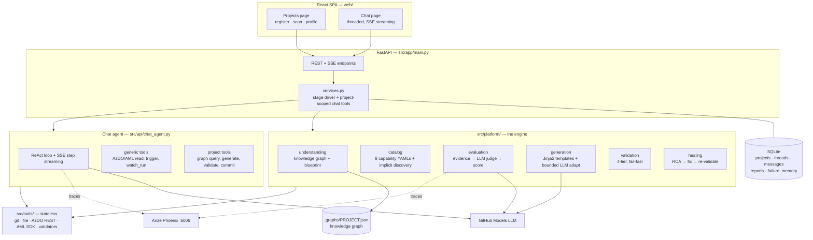
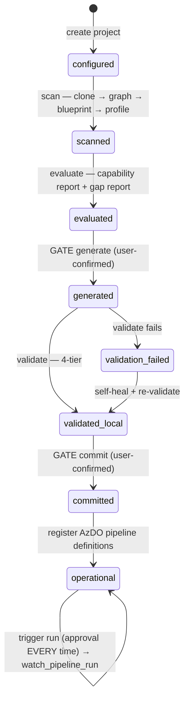
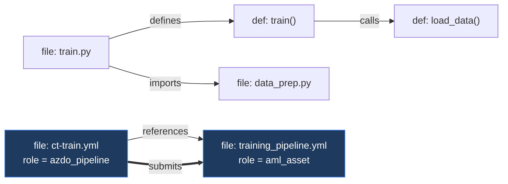
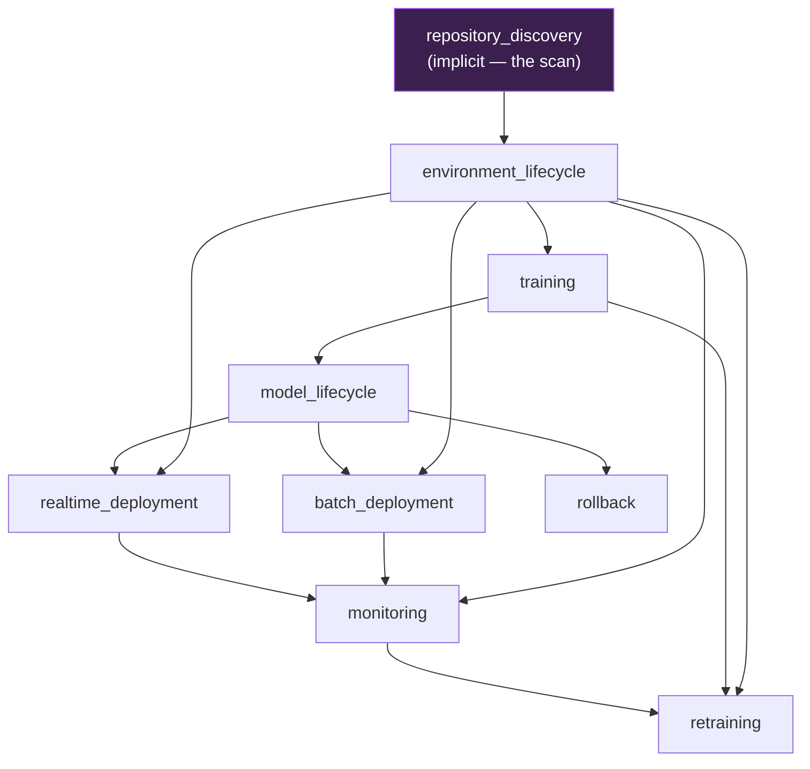
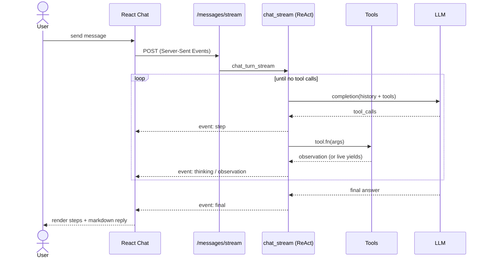

# MLOps Onboarding & Remediation Platform

Capability-driven agentic platform that onboards any Azure ML repository:
scans it into a knowledge graph, audits its MLOps maturity against an
enterprise capability ontology, generates missing assets from templates,
validates everything locally (zero failed cloud runs), self-heals, and — only
after your confirmation — commits and operates the pipelines.

Human-in-the-loop by design: generation, commits, and **every** Azure DevOps
pipeline trigger require explicit approval in chat.

## Quick start

```bash
pip install -r requirements.txt
cp .env.example .env          # GITHUB_TOKEN (LLM), PLATFORM_SECRET_KEY, optional Azure config

# backend
python -m uvicorn src.app.main:app --port 8000
# frontend
cd web && npm install && npm run dev   # http://localhost:5173
```

1. **Projects page** — register a project by providing an AzDO repo URL (with PAT) **OR** a local folder path (PAT bypass for local testing), hit **Scan**
2. Review/edit the auto-inferred profile (project type, target, metrics, endpoint, drift)
3. **Chat page** — threads are scoped per project (dropdown). Drive the workflow:
   - "evaluate the capabilities" → maturity scores + gap report
   - "generate the missing assets" → template-based generation (working tree only)
   - "validate" → 4-tier local validation + self-healing
   - "commit" → gated; requires `validated_local` + your explicit confirmation
   - "register the pipelines" → AzDO definitions created (no runs)
   - "trigger <pipeline>" → agent restates and waits for your approval, every time

## Architecture (v2)

### System components



### Workflow stages (the state machine)

The project `stage` column is the single source of truth. Each transition is a
service function; the two **human gates** (generate, commit) and every pipeline
trigger require explicit chat approval.



### Knowledge graph (repository understanding)

`understanding/graph_builder.py` builds a `networkx` DiGraph from the repo — no
LLM. The evaluator and chat query it; the LLM only ever sees digests, never the
raw repo. The `submits` edge encodes the platform's core rule: **AzDO
orchestrates, AML executes**.



| Node kind | Meaning | Edge kinds |
|---|---|---|
| `file:<path>` | every repo file (lang, role, entry-point flag) | `imports`, `references`, `submits` |
| `def:<path>:<name>` | Python function/class (signature, doc, calls) | `defines`, `calls` |

### Capability dependency graph

The catalog is a DAG (`depends_on` / `enables`). `dependency_order()`
topo-sorts it so the gap report is fixed root-first — `environment_lifecycle`
before anything, `retraining`/`rollback` last. Arrows point **enables →**.



### Chat turn with live step streaming

Every assistant turn is a ReAct loop streamed over SSE. Tool calls, their
observations, and any reasoning appear live in the UI; generator tools
(`generate_assets`, `watch_pipeline_run`) emit intermediate `thinking` events —
e.g. a triggered pipeline streams its status + log tail until it finishes.



Key properties:
- **Capability-driven, not file-driven** — capabilities are inferred from graph
  evidence; "AzDO orchestrates, AML executes" is enforced via graph `submits` edges
- **Token-bounded** — the LLM sees graph digests and evidence excerpts, never the repo
- **Deterministic scoring** — LLM judges evidence; weights/statuses are pure code
- **Validate-local-first** — AzDO `previewRun` parses pipelines server-side with
  zero runs created; org-setup tasks (approval environments, service connections)
  are reported separately from file defects
- **Conversational guardrails** — A pre-flight topic classifier checks messages (with
  recent context) to strictly block non-ML/Data queries while naturally permitting 
  affirmations (e.g. "yes", "proceed") in context.
- **Observability** — Arize Phoenix traces every graph node and LLM call
  (`python -m phoenix.server.main serve`, http://localhost:6006)

Design docs: [docs/ARCHITECTURE_V2.md](docs/ARCHITECTURE_V2.md) ·
[docs/REQUIREMENTS.md](docs/REQUIREMENTS.md)

## Tests

```bash
pytest src/tests -q   # 46 tests
```
