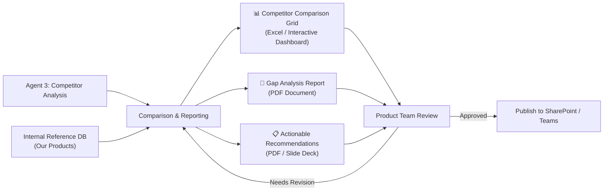
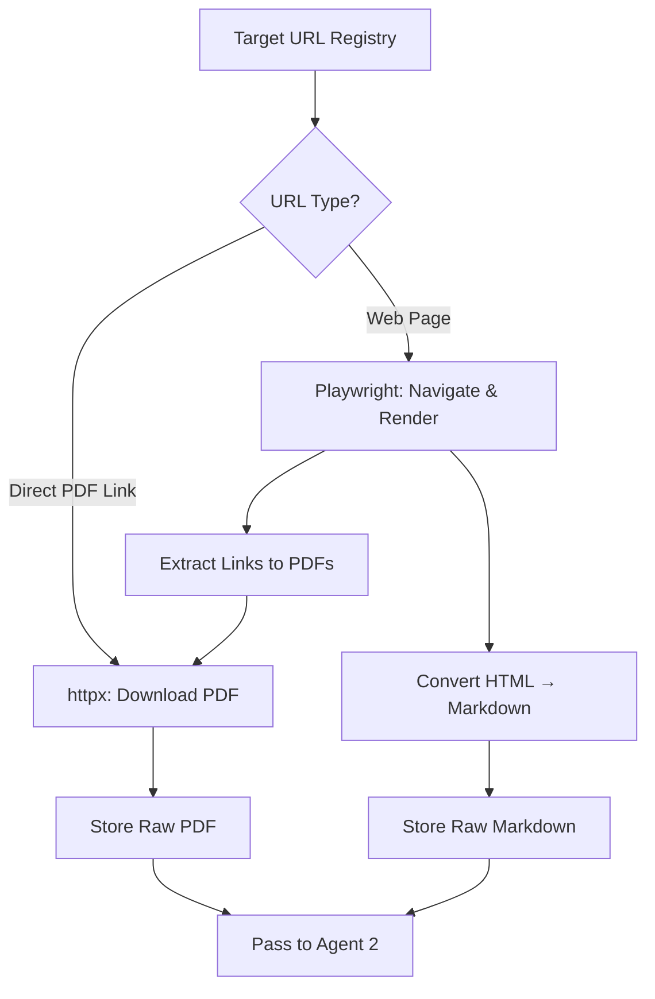
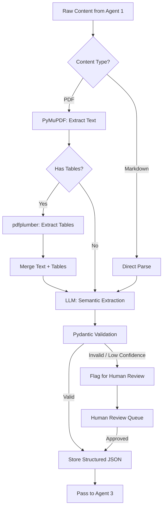
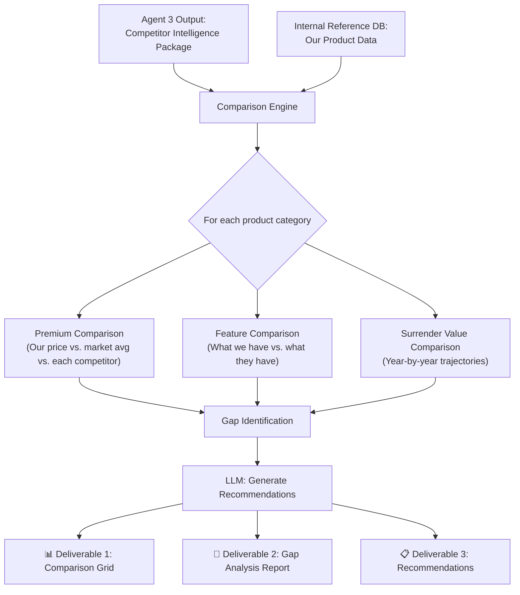
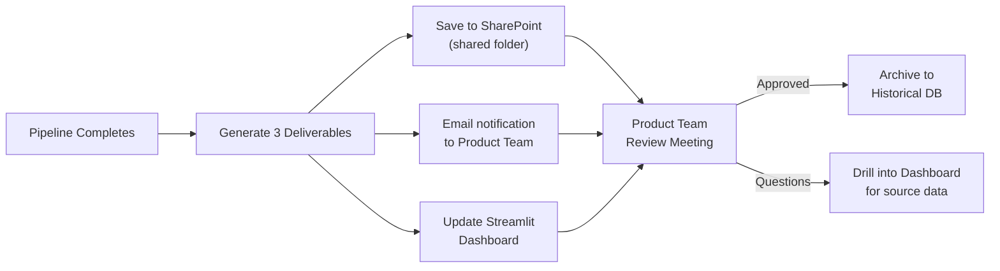

# Competitor Intelligence — In-House Agentic AI Solution

> **Conceptual Solution Document**
> **Date:** 29 April 2026 | **Status:** Draft for Review
> **Prepared for:** Product & Engineering Leadership

---

## 1. Executive Summary

The Product team currently spends **2–3 weeks** manually researching competitor product data — scraping PDFs, copying premium schedules, comparing surrender values, and compiling gap analyses. The marketing team has proposed procuring **V2 AI (v2.ai)**, a vendor that sells an AI-powered competitor intelligence platform to insurance companies, to solve this.

This document presents a strong case for **building this capability in-house** using an agentic AI architecture. The requirements are well-scoped, the data sources are publicly accessible, and the technology stack is mature. An in-house solution delivers **faster time-to-value, lower TCO, zero vendor lock-in, and full IP ownership** — while being architecturally simpler than what the team has already built (e.g., RAG pipelines, multi-agent lead nurturing systems).

> [!IMPORTANT]
> **Recommendation: Build In-House.** The scope of this problem (scrape → structure → compare → report) maps directly to a 3-agent pipeline using proven open-source tools. Subscribing to a vendor platform introduces unnecessary recurring cost, vendor lock-in, limited customization, and data sovereignty risk for what is fundamentally a tractable engineering problem that our team can own end-to-end.

---

## 2. Problem Statement (From Task Brief)

### 2.1 The Use Case

**Priority Use Case: Competitor Intelligence**

> *Automatically scrape, extract and structure competitor product data (such as disclosures, premiums, surrender values, benefit memorandums) and surface a structured gap analysis for Product teams. Research that takes 2–3 weeks today is completed in hours.*

### 2.2 AI-Powered Outcome

Enable product teams to receive structured competitor benchmarks and gap analysis through an agentic AI solution that **extracts, compares, and synthesises** competitor data from public PDFs.

### 2.3 Required Data Sources

| Source Type | Examples |
|---|---|
| Product Disclosures | Public PDF filings, regulatory portals |
| Premium Schedules | Competitor websites, rate filing databases |
| Surrender Values | Product brochures, benefit illustration PDFs |
| Benefit Memorandums | Publicly filed documents, insurer portals |

### 2.4 Required Deliverables

| Deliverable | Description |
|---|---|
| **Competitor Comparison Grid** | Structured side-by-side matrix of product features, premiums, and terms |
| **Gap Analysis Report** | Identification of where our products lag or lead vs. competitors |
| **Actionable Recommendations** | AI-generated strategic recommendations for the Product team |

---

## 3. Proposed Architecture — Four-Step Agent Pipeline

The system follows the exact flow outlined in the task brief, implemented as a **LangGraph multi-agent state machine**. Note the critical distinction: **Agent 3 analyzes competitor data**, then a **Comparison & Reporting step** merges that analysis with our internal product data to produce the final research output.

```
┌──────────────────────────────────────────────────────────────────────────────┐
│                          ORCHESTRATOR (LangGraph)                            │
│                      Stateful workflow with retry logic                      │
│                                                                              │
│  ┌──────────────┐   ┌─────────────────┐   ┌─────────────────┐               │
│  │   AGENT 1    │──▶│    AGENT 2      │──▶│    AGENT 3      │               │
│  │  Scraping    │   │  Structuring    │   │  Analysis       │               │
│  │  Agent       │   │  Agent          │   │  Agent          │               │
│  │              │   │                 │   │                 │               │
│  │ • Playwright │   │ • Normalize     │   │ • Profile each  │               │
│  │ • PDF fetch  │   │ • Validate      │   │   competitor    │               │
│  │ • Web scrape │   │ • Schema enforce│   │ • Summarize     │               │
│  └──────┬───────┘   └────────┬────────┘   │   products      │               │
│         │                    │            │ • Flag outliers  │               │
│         ▼                    ▼            └────────┬────────┘               │
│    Raw HTML/PDF        Structured JSON             │                        │
│    Downloads           (validated)                 ▼                        │
│                                          ┌─────────────────┐               │
│                                          │  COMPARISON &   │               │
│  ┌──────────────────────┐               │  REPORTING STEP │               │
│  │   INTERNAL REFERENCE │──────────────▶│                 │               │
│  │   DATABASE           │  Our product  │ • Compare us    │               │
│  │   (Our product data) │  data feeds   │   vs. them      │               │
│  │                      │  in here      │ • Gap analysis  │               │
│  │  • SharePoint        │               │ • Generate      │               │
│  │  • Product DB        │               │   deliverables  │               │
│  │  • Excel files       │               └────────┬────────┘               │
│  └──────────────────────┘                        │                        │
│                                                  ▼                        │
│                                       ┌──────────────────┐                │
│                                       │ RESEARCH OUTPUT  │                │
│                                       │                  │                │
│                                       │ 📊 Comparison   │                │
│                                       │    Grid (Excel)  │                │
│                                       │ 📄 Gap Analysis │                │
│                                       │    Report (PDF)  │                │
│                                       │ 📋 Actionable   │                │
│                                       │    Recs (PDF)    │                │
│                                       └────────┬─────────┘                │
│                                                │                          │
│                                                ▼                          │
│                                    ┌────────────────────┐                 │
│                                    │  PRODUCT TEAM      │                 │
│                                    │  REVIEW & SIGN-OFF │                 │
│                                    └────────────────────┘                 │
└──────────────────────────────────────────────────────────────────────────────┘
```

### How does the Research Output reach the Product Team?

The pipeline doesn't just dump a JSON file. The **Comparison & Reporting step** generates three distinct, human-readable deliverables (matching the task brief exactly) and routes them for review:



---

## 4. Detailed Agent Design

### 4.1 Agent 1 — Scraping Agent (Data Acquisition)

**Purpose:** Autonomously discover, navigate, and download competitor product data from web sources and public PDFs.

#### Technology Stack

| Component | Tool | Rationale |
|---|---|---|
| Browser Automation | **Playwright (Python)** | Handles JS-heavy portals, anti-bot measures, login flows |
| PDF Download | **httpx / aiohttp** | Async bulk downloading of linked PDF documents |
| Page-to-Markdown | **markdownify / html2text** | Convert scraped HTML to clean markdown for LLM consumption |
| Anti-Detection | **undetected-playwright** | Stealth mode for sites with bot detection |
| Scheduling | **APScheduler / Celery Beat** | Periodic re-scraping (weekly/monthly cadence) |

#### Workflow



#### Key Capabilities
- **URL Registry:** Maintain a configurable YAML/JSON registry of competitor URLs and PDF endpoints
- **Adaptive Navigation:** Use Playwright's `page.wait_for_selector()` and `page.evaluate()` for dynamic content
- **Rate Limiting:** Respectful scraping with configurable delays (1–3s between requests)
- **Session Management:** Handle cookie-based sessions and basic authentication where needed
- **Retry Logic:** Exponential backoff with dead-letter queue for persistently failing URLs

#### Sample Code Pattern

```python
from playwright.async_api import async_playwright
from langgraph.graph import StateGraph

async def scrape_competitor_page(state: AgentState) -> AgentState:
    """Scraping agent node in LangGraph."""
    async with async_playwright() as p:
        browser = await p.chromium.launch(headless=True)
        page = await browser.new_page()
        
        await page.goto(state["target_url"], wait_until="networkidle")
        
        # Extract PDF links
        pdf_links = await page.eval_on_selector_all(
            'a[href$=".pdf"]',
            'elements => elements.map(e => e.href)'
        )
        
        # Convert page content to markdown
        html_content = await page.content()
        markdown_content = html_to_markdown(html_content)
        
        await browser.close()
        
    return {
        **state,
        "raw_content": markdown_content,
        "pdf_links": pdf_links,
        "scrape_status": "success"
    }
```

---

### 4.2 Agent 2 — Structuring Agent (Normalize + Validate)

**Purpose:** Transform raw HTML/markdown and PDF content into validated, schema-compliant structured data.

#### Technology Stack

| Component | Tool | Rationale |
|---|---|---|
| PDF Text Extraction | **PyMuPDF (fitz)** | Fast, reliable text + layout extraction |
| Table Extraction | **pdfplumber** | Best-in-class table detection from PDFs |
| OCR Fallback | **Tesseract / Google Document AI** | For scanned/image-based PDFs |
| Schema Enforcement | **Pydantic v2** | Type-safe, validated data models |
| LLM Extraction | **OpenAI / Gemini (structured output)** | Semantic extraction with guaranteed JSON output |

#### Data Models (Pydantic Schemas)

```python
from pydantic import BaseModel, Field
from typing import Optional
from decimal import Decimal

class PremiumSchedule(BaseModel):
    """Structured premium data extracted from competitor documents."""
    competitor_name: str
    product_name: str
    product_type: str  # e.g., "Term Life", "Whole Life", "UL"
    age_band: str      # e.g., "30-35"
    gender: str
    smoker_status: str
    coverage_amount: Decimal
    annual_premium: Decimal
    payment_frequency: str
    effective_date: Optional[str] = None
    source_document: str
    extraction_confidence: float = Field(ge=0.0, le=1.0)

class SurrenderValue(BaseModel):
    """Surrender value schedule from benefit illustrations."""
    competitor_name: str
    product_name: str
    policy_year: int
    guaranteed_surrender_value: Decimal
    non_guaranteed_surrender_value: Optional[Decimal] = None
    cash_value: Decimal
    source_document: str
    extraction_confidence: float = Field(ge=0.0, le=1.0)

class ProductDisclosure(BaseModel):
    """Key disclosures and terms from competitor product filings."""
    competitor_name: str
    product_name: str
    exclusions: list[str]
    waiting_periods: list[str]
    riders_available: list[str]
    key_terms: dict[str, str]
    regulatory_filing_id: Optional[str] = None
    source_document: str
    extraction_confidence: float = Field(ge=0.0, le=1.0)

class BenefitMemorandum(BaseModel):
    """Structured benefit memorandum data."""
    competitor_name: str
    product_name: str
    benefit_features: list[str]
    coverage_details: dict[str, str]
    limitations: list[str]
    target_demographic: Optional[str] = None
    source_document: str
    extraction_confidence: float = Field(ge=0.0, le=1.0)
```

#### Extraction Workflow



#### Key Capabilities
- **Template-Free Extraction:** Uses LLM semantic understanding, not brittle regex/template patterns — adapts when competitors change document layouts
- **Confidence Scoring:** Every extracted data point includes a confidence score; low-confidence items are routed to human review
- **Multi-Format Support:** Handles selectable-text PDFs, scanned PDFs (via OCR), and web-scraped HTML
- **Deduplication:** Detects and merges duplicate entries from overlapping data sources

---

### 4.3 Agent 3 — Analysis Agent (Competitor Profiling)

**Purpose:** Process the structured competitor data from Agent 2 and build comprehensive competitor profiles. This agent focuses on **understanding what each competitor offers** — it does NOT compare against our products yet.

#### What Agent 3 Does (and Does NOT Do)

| Does ✅ | Does NOT Do ❌ |
|---|---|
| Profiles each competitor's product lineup | Compare against our internal products |
| Summarizes premium positioning across competitors | Generate gap analysis vs. our offerings |
| Flags outliers (unusually high/low premiums, unique riders) | Produce the final deliverables |
| Identifies market trends across the competitor set | Access our internal reference database |

#### Technology Stack

| Component | Tool | Rationale |
|---|---|---|
| Data Processing | **pandas** | Aggregate, pivot, and normalize competitor data |
| LLM Analysis | **GPT-4o / Gemini 1.5 Pro** | Narrative synthesis of competitor profiles |
| Output | **Structured JSON** | Clean, structured competitor intelligence passed to Comparison step |

#### Output: Competitor Intelligence Package

```json
{
  "analysis_metadata": {
    "generated_at": "2026-04-29T16:00:00Z",
    "competitors_analyzed": ["CompA", "CompB", "CompC"],
    "products_profiled": 12,
    "data_sources_used": 34
  },
  "competitor_profiles": [
    {
      "competitor": "CompA",
      "products": [
        {
          "name": "CompA Term-30",
          "type": "Term Life",
          "premium_range": {"min": 450, "max": 1200, "unit": "annual"},
          "key_features": ["Accelerated death benefit", "Conversion option to age 65"],
          "surrender_values": {"year_5": 0, "year_10": 0},
          "unique_riders": ["Critical illness rider at no extra cost"],
          "disclosures_summary": "Standard exclusions; 2-year contestability"
        }
      ],
      "market_position_summary": "Aggressive pricing in 30-40 age band with strong rider bundling"
    }
  ],
  "market_observations": [
    "3 of 3 competitors now offer accelerated death benefit as standard",
    "Average Term-30 premium for age 35 non-smoker: $680/year"
  ]
}
```

---

### 4.4 Comparison & Reporting Step (Our Products vs. Competitors)

**Purpose:** This is the critical step that the product team cares about most. It takes Agent 3's competitor intelligence and **merges it with our own product data** from the Internal Reference Database to produce the final deliverables.

> [!IMPORTANT]
> **This is where "us vs. them" happens.** Agent 3 tells us what competitors offer. The Comparison & Reporting step tells us how we stack up and what to do about it.

#### How It Works



#### Technology Stack

| Component | Tool | Rationale |
|---|---|---|
| Internal Data Access | **SQLAlchemy / pandas** | Query our product DB + read Excel/SharePoint exports |
| Comparison Engine | **pandas + numpy** | Side-by-side matrix generation, delta calculations, percentile ranking |
| LLM Synthesis | **GPT-4o / Gemini 1.5 Pro** | Generate narrative gap analysis and strategic recommendations |
| Grid Generation | **openpyxl** | Produce formatted Excel workbooks with conditional formatting |
| Report Generation | **Jinja2 + WeasyPrint** | Professional PDF report from HTML templates |
| Visualization | **Plotly / matplotlib** | Charts embedded in reports (premium curves, feature heatmaps) |

---

### 4.5 Deliverables — Exactly as Specified in the Task Brief

The three deliverables match the task image precisely. Here is how each is generated and delivered:

#### Deliverable 1: 📊 Competitor Comparison Grid

| Aspect | Detail |
|---|---|
| **Format** | Excel workbook (.xlsx) with multiple tabs + interactive Streamlit dashboard view |
| **Content** | Side-by-side matrix: rows = product features/metrics, columns = our product vs. each competitor |
| **Key Tabs** | (1) Premium Comparison, (2) Feature Matrix, (3) Surrender Values, (4) Riders & Benefits, (5) Disclosures |
| **Visual Cues** | Conditional formatting — green (we lead), red (we lag), yellow (comparable) |
| **Delivery** | Auto-saved to SharePoint shared folder + viewable in Streamlit dashboard |

**Example: Premium Comparison Tab**

| Product | Age Band | Our Premium | CompA | CompB | CompC | Market Avg | Our Position |
|---|---|---|---|---|---|---|---|
| Term-30 | 30–35 | $580 | $520 | $610 | $545 | $558 | 🟡 +4% above avg |
| Term-30 | 35–40 | $780 | $650 | $720 | $690 | $687 | 🔴 +14% above avg |
| Whole Life | 30–35 | $1,200 | $1,350 | $1,280 | $1,400 | $1,343 | 🟢 -11% below avg |

---

#### Deliverable 2: 📄 Gap Analysis Report

| Aspect | Detail |
|---|---|
| **Format** | PDF document (8–15 pages), auto-generated from Jinja2 template |
| **Content** | Narrative report identifying where we lead, lag, or match competitors |
| **Sections** | (1) Executive Summary, (2) Premium Positioning, (3) Feature Gaps, (4) Surrender Value Analysis, (5) Disclosure Comparison, (6) Market Trends |
| **Visuals** | Embedded charts — premium distribution curves, feature coverage heatmap, surrender value trajectories |
| **Delivery** | PDF auto-emailed to Product team distribution list + saved to SharePoint |

**Example Gap Entry:**

> **GAP: Critical Illness Rider** (Severity: High)
>
> CompA and CompC both offer a critical illness rider at no additional premium. Our product requires a separate rider purchase at $45/month. This creates a perceived value gap in the 35–45 demographic where critical illness coverage is a key purchase driver.
>
> *Source: comp_a_product_brochure_2026.pdf (p.4), comp_c_rate_filing_Q1_2026.pdf (p.12)*

---

#### Deliverable 3: 📋 Actionable Recommendations

| Aspect | Detail |
|---|---|
| **Format** | PDF document (3–5 pages) OR PowerPoint slide deck (for leadership presentations) |
| **Content** | Prioritized list of strategic actions based on gap analysis findings |
| **Structure** | Each recommendation includes: Finding → Impact Assessment → Suggested Action → Effort Estimate → Priority (P1/P2/P3) |
| **LLM Role** | Generates draft recommendations; Product team reviews and approves before distribution |
| **Delivery** | PDF/PPTX saved to SharePoint + presented in weekly Product team review meeting |

**Example Recommendation:**

| Priority | Recommendation | Based On | Expected Impact |
|---|---|---|---|
| **P1** | Bundle critical illness rider into base product at no extra cost | Gap: CompA & CompC include it free | Removes key competitive disadvantage in 35–45 segment |
| **P2** | Reduce Term-30 premium for 35–40 age band by 8–10% | Premium gap: +14% above market avg | Aligns with market; prevents quote-stage attrition |
| **P3** | Add conversion option to age 70 (currently 65) | Feature gap: CompB offers to age 70 | Low-cost enhancement; improves perceived flexibility |

---

### Delivery Workflow (End-to-End)



The Product team **never needs to touch the pipeline**. They receive:
1. An **email/Teams notification** that a new analysis is ready
2. **Three files** in the shared SharePoint folder (Excel grid + 2 PDFs)
3. A **live dashboard** where they can drill into the data interactively

---

## 5. Data Source Strategy

### 5.1 Web Sources (Playwright-Driven)

| Source Category | Access Method | Complexity |
|---|---|---|
| Competitor websites | Playwright navigation + content extraction | Medium |
| Rate filing portals (SERFF, state DOIs) | Playwright with form submission | Medium-High |
| Insurance comparison sites | Playwright with dynamic content handling | Medium |
| Regulatory databases | Direct HTTP + Playwright fallback | Low-Medium |

### 5.2 Document Sources (PDF Pipeline)

| Source Category | Processing Method | Complexity |
|---|---|---|
| Product disclosure PDFs | PyMuPDF text extraction + LLM parsing | Medium |
| Benefit memorandums | pdfplumber table extraction + LLM | Medium-High |
| Premium schedule PDFs | pdfplumber (tables) + Pydantic validation | Medium |
| Surrender value illustrations | pdfplumber (tables) + numerical validation | Medium |
| Scanned / image PDFs | Tesseract OCR → LLM extraction | High |

### 5.3 Internal Reference Data

| Source | Integration Method |
|---|---|
| Our product database | Direct DB connection (PostgreSQL/SQL Server) |
| SharePoint documents | Microsoft Graph API |
| Internal Excel files | pandas read_excel with openpyxl |

---

## 6. Technology Stack Summary

```
┌────────────────────────────────────────────────────────────┐
│                    APPLICATION LAYER                        │
│  Streamlit / FastAPI Dashboard  │  Scheduled Reports       │
├────────────────────────────────────────────────────────────┤
│                   ORCHESTRATION LAYER                       │
│  LangGraph (stateful multi-agent workflow)                 │
│  Celery + Redis (task queue & scheduling)                  │
├────────────────────────────────────────────────────────────┤
│                      AGENT LAYER                           │
│  Agent 1: Playwright + httpx     (Scraping)                │
│  Agent 2: PyMuPDF + pdfplumber + Pydantic  (Structuring)  │
│  Agent 3: pandas + LLM + Jinja2  (Analysis)               │
├────────────────────────────────────────────────────────────┤
│                    INTELLIGENCE LAYER                       │
│  OpenAI GPT-4o / Google Gemini 1.5 Pro (LLM)              │
│  Pydantic v2 (structured output enforcement)              │
├────────────────────────────────────────────────────────────┤
│                      DATA LAYER                            │
│  PostgreSQL (structured store)  │  MinIO/S3 (raw PDFs)    │
│  Redis (caching + state)        │  ChromaDB (embeddings)  │
└────────────────────────────────────────────────────────────┘
```

### Key Dependencies (All Open-Source or Standard Enterprise)

| Package | Purpose | License |
|---|---|---|
| `langgraph` | Multi-agent orchestration | MIT |
| `playwright` | Browser automation & web scraping | Apache 2.0 |
| `pymupdf` | PDF text/image extraction | AGPL (or commercial) |
| `pdfplumber` | PDF table extraction | MIT |
| `pydantic` | Data validation & schema enforcement | MIT |
| `openai` / `google-genai` | LLM integration | Commercial API |
| `pandas` | Data analysis & comparison | BSD |
| `fastapi` | API layer | MIT |
| `streamlit` | Dashboard UI | Apache 2.0 |
| `celery` | Task queue & scheduling | BSD |

---

## 7. Build vs. Buy Analysis

### 7.1 What V2 AI Offers — and Why It Falls Short

**V2 AI (v2.ai)** is a vendor that provides an AI-powered competitor intelligence platform specifically to insurance companies. Their solution promises to automate the extraction and comparison of competitor product data — which is exactly the use case described in our task brief.

> [!WARNING]
> **The problem with buying a vendor platform is not capability — it's control, cost, and customization.** V2 AI may deliver a working product, but it comes with inherent limitations that make an in-house build the stronger long-term investment for our specific needs.

#### Key Concerns with V2 AI

1. **Generic, Not Tailored** — V2 AI builds a one-size-fits-all platform for the insurance industry. Our product team has specific comparison dimensions, internal product taxonomies, and proprietary data that a generic platform cannot deeply integrate without expensive customization.
2. **Black Box Extraction** — We have no visibility into how V2 AI's scraping and extraction logic works. If a competitor changes their PDF format and V2 AI's parser breaks, we're waiting on their support queue — not fixing it ourselves in hours.
3. **Data Sovereignty Risk** — Our competitive intelligence data (what we're tracking, which competitors, our gap analysis priorities) flows through a third-party platform. This is strategically sensitive information.
4. **Vendor Roadmap Dependency** — Feature requests are subject to V2 AI's product roadmap and priorities across their entire customer base, not ours.
5. **Subscription Lock-in** — Once workflows, integrations, and team processes are built around V2 AI, switching costs become prohibitive.

| Factor | V2 AI (Vendor Platform) | In-House Build |
|---|---|---|
| **Nature** | SaaS platform — subscribe & configure | Our team builds & owns |
| **Cost Model** | Annual subscription + per-seat/usage fees | Internal FTE time + LLM API costs |
| **IP Ownership** | V2 AI owns the platform; we rent access | **100% ours** |
| **Domain Fit** | Generic insurance CI — serves many carriers | **Tailored to our exact product taxonomy** |
| **Customization** | Limited to platform configuration options | **Unlimited — we own the code** |
| **Extraction Logic** | Black box — vendor maintains | **Transparent — we debug and iterate** |
| **Data Security** | Our CI data processed on vendor infrastructure | **Data never leaves our infrastructure** |
| **Vendor Lock-in** | High — migration cost grows over time | **Zero lock-in** |
| **Time to First Value** | 4–8 weeks (procurement + onboarding + config) | **6–8 weeks** (we know the domain) |
| **Long-term Agility** | Constrained by vendor feature roadmap | **We set our own roadmap** |

### 7.2 Cost Comparison (Estimated 12-Month TCO)

| Cost Category | V2 AI Platform (Buy) | In-House (Build) |
|---|---|---|
| Platform / Development | $80K–$150K/year (enterprise SaaS license) | ~$40K (2 engineers × 6–8 weeks FTE allocation) |
| Implementation & Onboarding | $15K–$30K (vendor professional services) | Included in dev time |
| LLM API Costs | Bundled (opaque pricing) | $500–$2K/month (transparent, pay-per-use) |
| Infrastructure (Cloud) | Included in subscription | $200–$500/month |
| Customization / Integrations | $10K–$30K (professional services add-ons) | Engineering sprint (no extra cost) |
| Annual Renewal (Year 2+) | $80K–$150K/year (with potential price increases) | ~$15K/year (maintenance FTE + API costs) |
| **12-Month Total** | **$120K–$250K** | **$60K–$90K** |
| **24-Month Total** | **$200K–$400K** | **$75K–$105K** |

> [!TIP]
> **The in-house approach is 2–3× cheaper over 12 months and 3–4× cheaper over 24 months**, while building a reusable platform capability that can be extended to other use cases (regulatory monitoring, product benchmarking, market surveillance). The cost gap widens every year because the vendor charges recurring license fees while our maintenance costs are marginal.

### 7.3 Strategic Advantages of In-House

1. **Institutional Knowledge Retention** — The scraping logic, extraction schemas, and comparison methodology become organizational assets, not locked in a vendor's black box
2. **Iterative Improvement** — Product team can request changes in sprint cadence, not change-order cycles
3. **Reusability** — The same agent pipeline can be repurposed for regulatory filing monitoring, market trend analysis, or customer-facing product comparisons
4. **Data Sovereignty** — Sensitive competitive intelligence never leaves our infrastructure
5. **Existing Expertise** — Our team has demonstrated capability in RAG pipelines, LangGraph multi-agent systems, and document processing (see: industrial document RAG, lead nurturing multi-agent system)

---

## 8. Risk Register & Mitigation

### 8.1 Technical Risks

| # | Risk | Likelihood | Impact | Mitigation Strategy |
|---|---|---|---|---|
| R1 | **Anti-scraping measures** — Competitor sites block our scrapers (CAPTCHAs, IP bans, dynamic rendering) | Medium | High | Use `undetected-playwright` with rotating residential proxies. Implement respectful rate limiting (2–5s delays). Fall back to manual PDF download for hardened sites. |
| R2 | **PDF layout variance** — Competitors change document formats, breaking extraction | Medium | Medium | Use LLM-based semantic extraction (template-free) instead of rigid regex/template patterns. Schema validation catches format drift immediately. |
| R3 | **OCR accuracy on scanned PDFs** — Poor quality scans lead to extraction errors | Low | Medium | Use Google Document AI or Azure Form Recognizer as OCR backend. Implement confidence scoring; route low-confidence extractions to human review queue. |
| R4 | **LLM hallucination** — Model generates fabricated premium values or product features | Medium | Critical | **Never use LLM output as final truth for numerical data.** Cross-validate extracted numbers against PDF source text. Implement automated sanity checks (e.g., premium values within expected ranges). Human-in-the-loop for final sign-off. |
| R5 | **Data staleness** — Competitors update products but our scraper hasn't re-run | Low | Medium | Implement scheduled re-scraping (weekly cadence). Change detection alerts when source pages are modified. |

### 8.2 Operational Risks

| # | Risk | Likelihood | Impact | Mitigation Strategy |
|---|---|---|---|---|
| R6 | **Legal/compliance concerns** — Scraping may violate Terms of Service | Low | High | Only scrape publicly available data. Consult Legal on ToS review for each target site. Use robots.txt compliance. Focus on public regulatory filings which are explicitly open. |
| R7 | **Team capacity constraints** — Engineering team stretched too thin | Medium | Medium | Phase the build (see Roadmap). MVP in 6 weeks targets highest-value data sources only. Avoid scope creep — start with 3 competitors, expand later. |
| R8 | **Single point of failure** — Key developer leaves mid-project | Low | High | Ensure pair programming and documentation. Use well-known, well-documented open-source tools (LangGraph, Playwright) so any Python engineer can maintain. |
| R9 | **Scope creep** — Product team requests expand beyond original brief | High | Medium | Strict MVP definition. Use a product backlog with prioritization. Phase 1 = core pipeline only. Fancy features (real-time monitoring, predictive analytics) are Phase 2+. |

### 8.3 Data Quality Risks

| # | Risk | Likelihood | Impact | Mitigation Strategy |
|---|---|---|---|---|
| R10 | **Incomplete competitor coverage** — Some competitors have minimal public data | Medium | Medium | Identify data-rich vs. data-sparse competitors upfront. For sparse competitors, supplement with manual research initially and automate as data becomes available. |
| R11 | **Data currency gaps** — Extracted data may not reflect the latest product versions | Medium | Medium | Timestamp all extracted data. Display "last scraped" dates prominently in reports. Alert when data is older than configured threshold (e.g., 30 days). |

---

## 9. Implementation Roadmap

### Phase 1 — MVP (Weeks 1–6) ✦ Target: Quick Win

| Week | Milestone | Details |
|---|---|---|
| 1–2 | **Foundation** | Set up project structure, LangGraph skeleton, Pydantic schemas, target URL registry for top 3 competitors |
| 3–4 | **Agent 1 + Agent 2** | Playwright scrapers for identified URLs + PDF download pipeline. PyMuPDF/pdfplumber extraction with Pydantic validation |
| 5 | **Agent 3 (Basic)** | Pandas-based comparison grid. Basic gap identification. Static report generation (markdown/HTML) |
| 6 | **Integration & Demo** | Connect to internal reference DB. End-to-end pipeline test with real competitor data. Product team demo |

**MVP Deliverables:**
- Automated scraping of 3 competitors' public PDFs
- Structured extraction of premium schedules and key product features
- Basic competitor comparison grid (tabular format)
- One-click pipeline execution

---

### Phase 2 — Production Hardening (Weeks 7–10)

| Week | Milestone | Details |
|---|---|---|
| 7–8 | **Robustness** | Error handling, retry logic, anti-detection measures, logging & monitoring (Prometheus + Grafana) |
| 9 | **Scheduling & Alerts** | Celery Beat scheduling (weekly re-scrape). Slack/Teams alerts on new data or pipeline failures |
| 10 | **Dashboard** | Streamlit or FastAPI + React dashboard for Product team self-service |

---

### Phase 3 — Intelligence Enhancement (Weeks 11–16)

| Week | Milestone | Details |
|---|---|---|
| 11–12 | **Advanced Analysis** | LLM-powered narrative gap analysis and strategic recommendations. Trend tracking over time |
| 13–14 | **Expanded Coverage** | Add 5+ competitors. Add new data source types (regulatory filings, news monitoring) |
| 15–16 | **Change Detection** | Automated detection of competitor product changes. Delta reports ("what changed since last analysis") |

---

## 10. Success Metrics

| Metric | Current State | Target (Post-MVP) | Target (Phase 3) |
|---|---|---|---|
| Time to complete competitor analysis | 2–3 weeks | < 4 hours | < 1 hour (fully automated) |
| Number of competitors tracked | 2–3 (manual) | 3–5 (automated) | 10+ |
| Data freshness | Quarterly (at best) | Weekly | Real-time change detection |
| Product team effort per analysis | ~80 person-hours | ~2 hours (review only) | ~30 min (review only) |
| Extraction accuracy | N/A (manual) | >90% | >95% |

---

## 11. Conclusion & Recommendation

> [!CAUTION]
> **Subscribing to V2 AI for this use case is an unnecessary expenditure.** While V2 AI offers a capable platform for insurance competitor intelligence, we would be paying $120K–$250K/year for a black-box solution that we can build in-house for a fraction of the cost — with full ownership, deeper customization, and zero vendor dependency. The competitive intelligence generated by this system is strategically sensitive; it should live on our infrastructure, not a vendor's.

### The In-House Advantage in Summary

| Dimension | Verdict |
|---|---|
| **Technical Feasibility** | ✅ All required components are mature, open-source, and well-documented |
| **Team Capability** | ✅ Existing experience with LangGraph, multi-agent systems, RAG pipelines, and document processing |
| **Cost Efficiency** | ✅ 2–3× cheaper than vendor platform over 12 months; 3–4× cheaper over 24 months |
| **Time to Value** | ✅ MVP in 6 weeks — comparable to vendor onboarding timeline |
| **Strategic Value** | ✅ Builds reusable platform capability; retains all IP |
| **Data Security** | ✅ All competitor data stays within our infrastructure |

### Recommended Next Steps

1. **Approve in-house build** — Allocate 2 engineers for 6-week MVP sprint
2. **Define target competitors** — Product team identifies top 3 priority competitors and their public data sources
3. **Legal review** — Confirm ToS compliance for target scraping sites
4. **Internal reference DB** — Product team provides structured export of our own product data for comparison baseline
5. **Kick-off** — Begin Phase 1 (Week 1: project setup + URL registry + schema definition)

---

> **This document is ready for review.** Please provide feedback on the scope, architecture, or any questions before we proceed to implementation planning.
