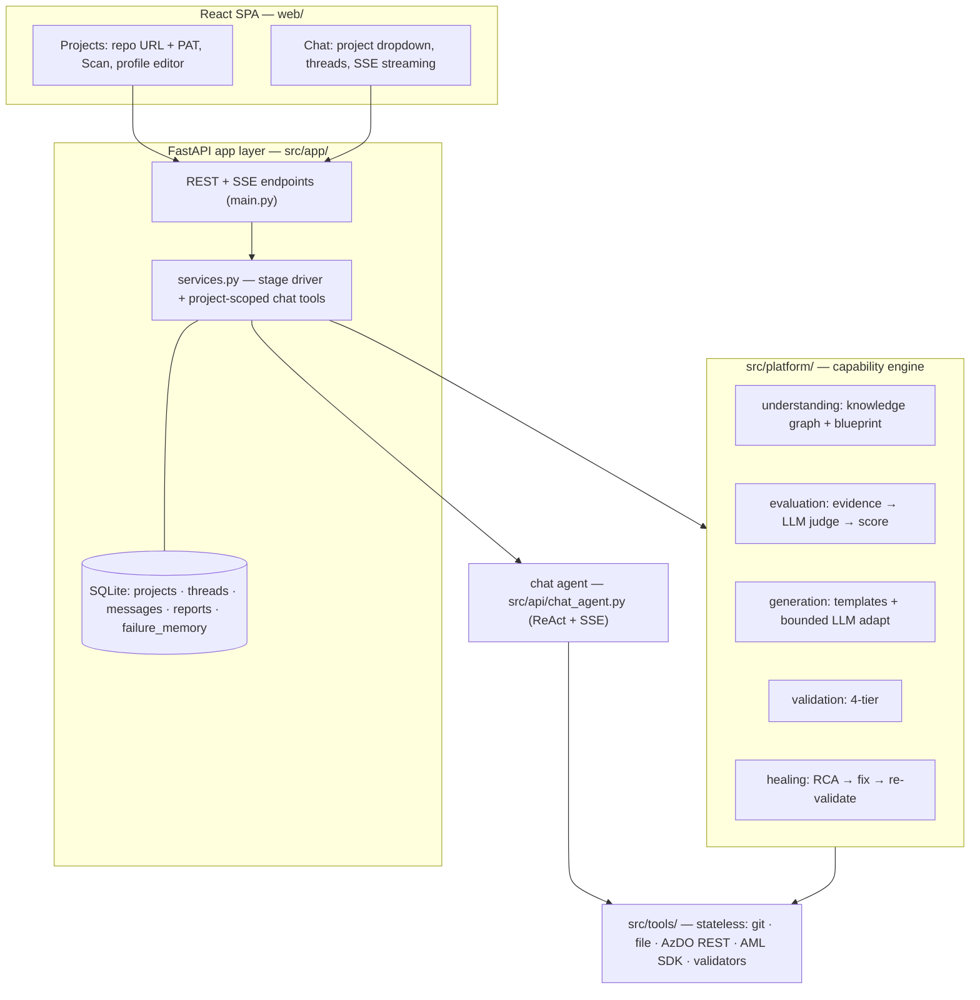

# Architecture v2 — Capability-Driven MLOps Onboarding Platform

Implementation reference for the shipped platform. Supersedes the v1 file-driven
design. (An earlier draft of this doc proposed a LangGraph supervisor with agent
subgraphs and graph interrupts; the implementation instead drives the stages as
plain service functions gated by the project `stage` column and chat approvals —
simpler, fully resumable from the DB, and what §2/§11 below now describe.)

---

## 1. Principles

1. **Capability-driven**: the unit of reasoning is a business capability ("can this repo
   train a model?"), never a filename. Files are evidence, not truth.
2. **Evidence-based scoring**: every capability is COMPLETE / PARTIAL / MISSING with a
   weighted score and named missing components.
3. **Template-first generation**: 80% adaptation of curated enterprise templates,
   20% LLM reasoning to specialize them to the repo.
4. **Validate locally, commit late**: nothing reaches the remote until static, local-exec,
   AML, and AzDO-preview validation all pass.
5. **Autonomous within stages, human-gated between**: two hard gates — generation
   kickoff and commit — enforced as chat-tool preconditions on the project `stage`
   (plus per-trigger approval for pipeline runs).
6. **Graph-based understanding**: the LLM never sees the whole repo; it sees a knowledge
   graph digest and queries the graph on demand.

---

## 2. System overview



No central orchestrator process runs the stages: each stage is a service
function (`scan_project`, `evaluate_project`, `generate_project`,
`validate_project`, `commit_project`, `register_pipelines`) invoked directly from
REST endpoints or chat tools. The project `stage` column is the resumable state —
restart the API and a project picks up exactly where it left off. Human gates are
not graph interrupts; they are chat-tool preconditions (generation only on
explicit ask; commit only at `validated_local` after confirmation; every pipeline
trigger re-confirmed).

---

## 3. Folder structure

```
src/
├── app/                        # FastAPI application layer
│   ├── main.py                 # REST + SSE endpoints (projects, threads, chat, scan…)
│   ├── db.py                   # SQLAlchemy models: projects, threads, messages,
│   │                           #   reports, failure_memory (stage lives on projects)
│   ├── crypto.py               # PAT encryption (Fernet, key from PLATFORM_SECRET_KEY)
│   ├── project_context.py      # per-project activation (PAT/AzDO env scoping)
│   └── services.py             # stage driver (scan/evaluate/generate/validate/commit/
│                               #   register) + project-scoped chat tools (_graph_tools)
├── platform/
│   ├── catalog/                # CAPABILITY CATALOG (YAML ontology, one file per capability)
│   ├── templates/              # TEMPLATE LIBRARY (Jinja2)
│   │   ├── environment_lifecycle/  training/  model_lifecycle/  batch_deployment/
│   │   ├── realtime_deployment/  monitoring/  retraining/  rollback/
│   │   └── (each: *.j2 files + template.yaml manifest with parameters)
│   ├── understanding/          # graph_builder (networkx, AST), blueprint, retrieval
│   ├── evaluation/             # capability evaluator, scoring, gap analysis
│   ├── generation/             # template engine + LLM adaptation
│   ├── validation/             # tiered validation framework
│   └── healing/                # RCA + patch + retry framework
├── api/                        # chat_agent.py (ReAct loop + SSE streaming),
│                               #   jobs.py (background-job registry)
├── tools/                      # stateless: git, file, AzDO REST, AML SDK, validators
├── llm/  memory/  shared/  config/   # carried from v1
└── tests/
web/                            # React: pages/Projects, pages/Chat, threads, dropdown
```

> Note: there is **no** `src/graphs/` package and no LangGraph supervisor/agent
> subgraphs — the v1 multi-agent system was removed. The only "graph" at runtime
> is the per-repo **knowledge graph** (`networkx`, persisted to `.graphs/`).
> Repository parsing uses Python's `ast`, not tree-sitter.

---

## 4. Capability catalog (the ontology)

One YAML per capability under `src/platform/catalog/`. Schema:

```yaml
# catalog/training.yaml  (actual schema — see src/platform/catalog/loader.py::CapabilitySpec)
capability: training
purpose: Produce a trained, evaluated model artifact from data
depends_on: [environment_lifecycle]
enables: [model_lifecycle, retraining]
evidence:                    # SEMANTIC evidence specs; weights MUST sum to 100
  - id: code_functions
    kind: code_semantic      # code_semantic | aml_asset | azdo_pipeline
    description: Data loading, feature engineering, training, evaluation in code
    indicators: [fit, train, read_csv, feature, evaluate, accuracy, score, metric]
    weight: 30
  - id: aml_training_assets
    kind: aml_asset
    description: AML command components and/or pipeline job that run the training code
    role: training pipeline / components
    weight: 40
  - id: azdo_orchestration
    kind: azdo_pipeline
    description: AzDO pipeline that SUBMITS the AML training pipeline
    role: submits training
    weight: 30
deliverables:                # what generation produces, keyed by evidence id
  code_functions: [src/train.py, src/evaluate.py]
  aml_training_assets: [aml/components/train.yml, aml/pipelines/training_pipeline.yml]
  azdo_orchestration: [azdopipelines/ct-train.yml]
validation:
  - local az ml job create (training pipeline, dev)
  - azdo previewRun
```

Field reference (`EvidenceSpec` / `CapabilitySpec`): `evidence[].weight` must sum
to 100 per capability (validated at load); `kind` is one of `code_semantic`
(matched via `indicators` against graph node summaries), `aml_asset`, or
`azdo_pipeline` (judged against the repo inventory). `deliverables` is a map from
evidence `id` → the template files generation emits when that component is missing.

The 9 capabilities: `repository_discovery` (implicit — complete once a graph +
blueprint exist), `environment_lifecycle, training, model_lifecycle,
batch_deployment, realtime_deployment, monitoring, retraining, rollback`.

**Catalog is data, not prompts.** The evaluator and generator read it; prompts reference
it by interpolation. Editing the ontology never means editing agent code.

Key encoded knowledge:
- environment_lifecycle = build → dev ACR → dev env → validate → QA → Prod (root, dependency-free)
- AzDO orchestrates, AML executes: AML assets WITHOUT an AzDO pipeline that submits them ⇒ PARTIAL
- model_lifecycle may be implemented purely in pipelines — never flag "missing .py" if
  registration/promotion happens in YAML
- monitoring: concept drift requires label availability — evaluator must check for it
- deployment strategy (batch vs realtime) inferred from project profile + endpoint evidence

---

## 5. Repository understanding framework

Pipeline (deterministic, local — Python `ast`, `networkx`):

```
clone → file tree → code graph (defs/calls/imports) → asset graph
  (AML YAML → scripts they invoke; AzDO YAML → AML assets they submit;
   configs → consumers) → dependency graph → REPOSITORY BLUEPRINT
```

**Blueprint** (Pydantic, stored in Project Memory):

```python
class RepositoryBlueprint(BaseModel):
    project_type: Literal["binary_classification","multiclass_classification",
                          "regression","forecasting","nlp","computer_vision","custom"]
    target_variable: str | None
    metrics: list[str]
    endpoint_strategy: Literal["realtime","batch","both","none"]
    drift_kinds: list[str]              # data / prediction / concept
    entry_points: list[EntryPoint]      # path, function, args
    aml_assets: list[AssetRef]          # kind, path, references
    azdo_pipelines: list[PipelineRef]   # path, what it submits/orchestrates
    graph_stats: GraphStats
```

Project profile fields (type, target, metrics, endpoint, drift) are inferred by the LLM
from **graph retrieval results** (entry-point signatures, evaluation code, dataset
columns touched), shown on Page 1 for the user to edit/confirm.

**Graph retrieval** (token control — repo never sent whole):
- `graph_digest(max_tokens)` — ranked by centrality
- `who_references(path)` / `what_does(path)` / `entry_point_signature(path)`
- `find_evidence(indicators: list[str])` — semantic grep over node summaries; this is
  what the capability evaluator calls per evidence spec

---

## 6. Capability evaluator

```
Blueprint + Graph → per-capability evidence collection (find_evidence + asset graph)
  → LLM judgment per evidence item (FOUND / WEAK / ABSENT, with citation into graph)
  → deterministic weighted scoring from catalog weights
  → CapabilityReport
```

```python
# actual models — src/platform/evaluation/evaluator.py
class EvidenceJudgment(BaseModel):
    evidence_id: str                     # "<capability>.<evidence id>"
    status: Literal["found","weak","absent"]   # weak = half weight
    citations: list[str]; note: str
class CapabilityStatus(BaseModel):
    capability: str
    score: int                           # 0-100, weights from catalog
    status: Literal["complete","partial","missing"]
    evidence: list[EvidenceJudgment]     # auditable, cites graph nodes/files
    missing_components: list[str]        # evidence ids not 'found'
class CapabilityReport(BaseModel):
    capabilities: list[CapabilityStatus]; summary: str
```

Judgments are chunked (3 capabilities per LLM call) with a one-shot repair pass
for any ids the model fails to return; scoring is then pure code.

The LLM judges evidence; the **arithmetic is deterministic** — same evidence ⇒ same score.
Gap analysis = catalog deliverables minus found components, ordered by `depends_on`
(environment_lifecycle first, rollback last).

---

## 7. Template library + generation

Each template dir has a `template.yaml` manifest:

```yaml
name: ct-train-register
capability: training
files: [azdo/ct-train.yml.j2, aml/train_component.yml.j2]
parameters: [project_name, entry_point, entry_args, environment_name,
             compute_target, model_name, metrics]
constraints: [requires environment_lifecycle complete]
```

Generation per missing component:
1. **Template Retrieval Agent** picks the template via catalog mapping + blueprint
2. Jinja2 render with blueprint/profile parameters (the deterministic 80%)
3. **LLM adaptation pass** (the 20%): adjust entry-point args, metric names, column
   names — diff-reviewed against template to prevent drift from standards
4. Write to working tree (never committed yet)

---

## 8. Validation framework (tiered, fail-fast)

```
T1 static     yaml/schema lint, dockerfile rules, az ml validate (client-side schema)
T2 local exec python import checks, pytest if present, dry-run entry points
T3 AML        az cli submissions from local: env build, training pipeline,
              deployment (dev), monitoring job — expect terminal success
T4 AzDO       previewRun=true per generated pipeline (server parses/expands YAML,
              creates NO run)  ⇒ catches unauthorized variable groups, bad tasks
```

Validation rules come from the catalog per capability. Results aggregate into a
`ValidationReport` shown in chat. T3 runs against the **dev** environment only;
QA/Prod promotion happens post-commit through the generated AzDO pipelines.

---

## 9. Self-healing framework

Carried from v1 (proven live) and generalized:

```
failure → collect logs (az cli output / AML job logs / preview API errors)
        → RCA (ReAct over repo graph + logs; failure memory consulted for similar fixes)
        → FixBundle (complete file contents, only implicated files)
        → fix validation (static + reviewer + implicated-files constraint)
        → patch working tree → re-run failed tier only
bounded by max_retries per tier; exhaustion ⇒ surface to chat with RCA + manual steps
every cycle recorded to Failure Memory: {failure, root_cause, fix, outcome}
```

---

## 10. Memory design

| Store | Backing | Contents |
|---|---|---|
| Project Memory | SQLite (`projects`, `reports`) | blueprint, capability report, gap report, profile, architecture/deployment decisions |
| Failure Memory | SQLite (`failure_memory`) | failure signature, RCA, fix, outcome — retrieved by similarity during RCA |
| Knowledge Memory | repo files (versioned) | capability catalog, template library, validation rules, enterprise standards |

Knowledge Memory lives in git deliberately: ontology changes are code-reviewed.

---

## 11. Stage driver (how the workflow advances)

There is no graph engine and no in-memory workflow object. State is the project
row; advancing the workflow means calling a service function that reads the
prior `reports`, does its work, writes a new report, and bumps `stage`.

**State** — columns on `projects` + rows in `reports` (`src/app/db.py`):

```python
class Project(Base):
    id; name; repo_url; pat_encrypted
    profile: dict          # type, target, metrics, endpoint, drift (+ inferred)
    stage: str             # configured → scanned → evaluated → generated →
                           #   validated_local | validation_failed → committed → operational
    local_repo_path: str   # the user-selected clone (never inside this agent repo)
    base_branch: str
# reports(kind in {blueprint, capability, gap, generation, validation, operations})
# failure_memory(signature, rca, fix, outcome)  — consulted during healing
```

**Stage functions** (`src/app/services.py`), each `(session, project) -> dict`:

| Function | Stage set | Reads | Writes |
|---|---|---|---|
| `scan_project` | `scanned` | clone | graph (`.graphs/`), `blueprint` report, profile |
| `evaluate_project` | `evaluated` | graph | `capability` + `gap` reports |
| `generate_project` | `generated` | `gap` | files (working tree), `generation` report |
| `validate_project` | `validated_local` / `validation_failed` | `generation` | `validation` report (+ self-heal) |
| `commit_project` | `committed` | `validation` | branch + commit + push |
| `register_pipelines` | `operational` | `generation` | AzDO pipeline definitions, `operations` report |

**Control flow & gates** — enforced in code, not graph edges:
- generation runs **only** when the user asks (chat tool `generate_missing_assets`)
- `validate_project` self-heals on failure (bounded) and re-validates the failed tier
- `commit_project` refuses unless `stage == validated_local` **and** the user
  confirmed in a prior message (the `commit_generated_assets` tool is a hard gate)
- `register_pipelines` requires `committed`; it creates definitions, never runs
- every `trigger_pipeline` is re-confirmed; `watch_pipeline_run` then streams it

**Resumability:** because the source of truth is the DB, restarting the API loses
nothing — the next chat turn or REST call reads `stage` + the latest reports and
continues. This replaces the originally-planned `SqliteSaver` checkpointer.

---

## 12. App layer (chat, threads, projects)

SQLite schema:

```
projects(id, name, repo_url, pat_encrypted, profile, stage,
         local_repo_path, base_branch, created_at)
threads(id, project_id→projects, title, created_at)
messages(id, thread_id→threads, role, content, created_at)
reports(id, project_id, kind, payload, created_at)   # blueprint/capability/gap/
                                                     #   generation/validation/operations
failure_memory(id, project_id, signature, rca, fix, outcome, created_at)
```

API (`src/app/main.py`):

```
POST   /api/projects                       {name, repo_url, pat, base_branch}   # PAT encrypted
GET    /api/projects   ·   DELETE /api/projects/{id}
POST   /api/projects/{id}/scan             {local_path, branch}                 # clone+graph+blueprint
POST   /api/projects/{id}/evaluate · /generate · /validate · /commit · /register-pipelines
GET    /api/projects/{id}/reports[?kind=]  ·  PATCH /api/projects/{id}/profile
GET    /api/projects/{id}/branches                                             # via stored PAT
GET/POST /api/projects/{id}/threads  ·  DELETE /api/threads/{id}
GET    /api/threads/{id}/messages
POST   /api/threads/{id}/messages                                              # chat turn (blocking)
POST   /api/threads/{id}/messages/stream                                       # chat turn (SSE)
GET    /api/browse                                                             # native folder picker
POST   /api/repos/branches   {repo_url, pat}                                   # pre-create branch list
```

Chat turns run a single tool-calling agent (`src/api/chat_agent.py`). Ops
questions and workflow commands ("generate", "validate", "commit") are the same
mechanism — the model calls the matching project-scoped tool, which invokes the
stage function. The stage gates (above) enforce ordering and confirmation.

**Frontend:** Page 1 Projects (form with live branch dropdown, Scan via folder
picker, editable profile card, delete); Page 2 Chat (project dropdown → that
project's threads only; new/delete threads; reports rendered as markdown; agent
steps + pipeline-run status streamed live via SSE). Gates are conversational —
the agent restates the action and waits for a "yes" in a following message.

---

## 13. Security design

- PAT encrypted at rest (Fernet; key from env `PLATFORM_SECRET_KEY`, not in repo)
- PAT never enters prompts, logs, or generated files; redaction filter on the logging
  formatter and on chat-visible tool outputs
- The repo is cloned to a **user-selected folder** (stored as `local_repo_path`);
  clones never land inside this agent repo, and all generation/validation/commit
  operate on that path
- Audit trail: every gate decision + commit + deployment recorded in `reports`
- Generated assets never contain secrets — variable groups / service connections only

## 14. Scalability design

- Long operations (scan, validation, healing) run on a worker pool (ThreadPool now;
  the API stays responsive; jobs surfaced via the existing background-job registry)
- SQLite → Postgres is a connection-string swap (SQLAlchemy)
- Stateless API + DB-resident stage ⇒ horizontal scaling when needed
- Production shape: containerized API+worker, static web build behind reverse proxy,
  or Azure Container Apps + Azure Files for workspaces

---

## 15. Phased delivery

| Phase | Scope | Builds on |
|---|---|---|
| **P1 Foundation** | SQLite + app layer (projects/threads/messages/PAT), two-page frontend, project dropdown + threads | v1 chat console |
| **P2 Understanding** | AST repo graph (networkx), blueprint extractor, profile auto-fill, Scan flow | P1 |
| **P3 Ontology** | capability catalog (9 YAMLs), evaluator + scoring, gap report in chat | P2 |
| **P4 Generation** | template library, retrieval + Jinja2 + LLM adaptation, generate gate | P3 |
| **P5 Validation+Healing** | tiered validation (az cli local, previewRun), self-healing loop, commit gate + commit | P4 |
| **P6 Operations** | deployment trigger, monitoring, retraining, rollback capabilities end-to-end | P5 |

Each phase is independently shippable and testable against `logistic_regression`.
